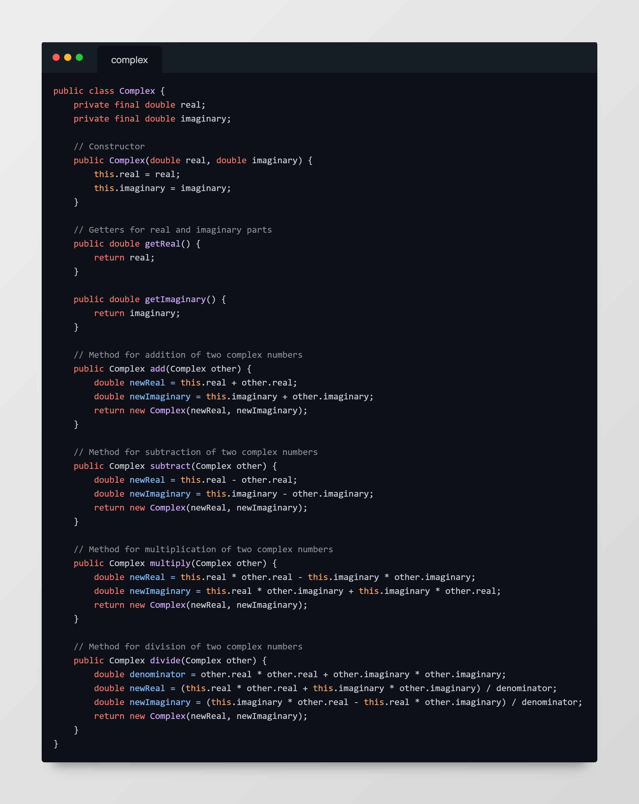
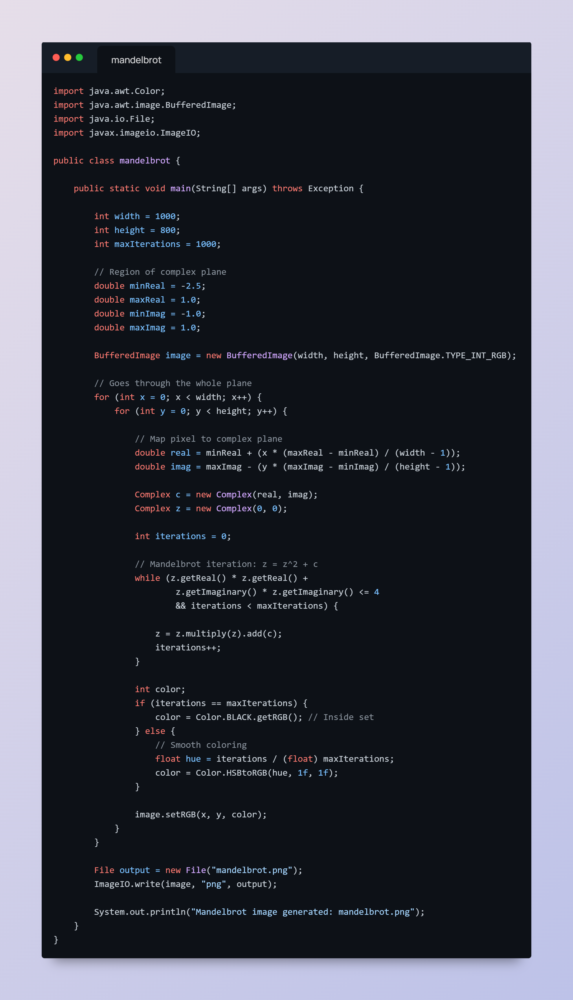
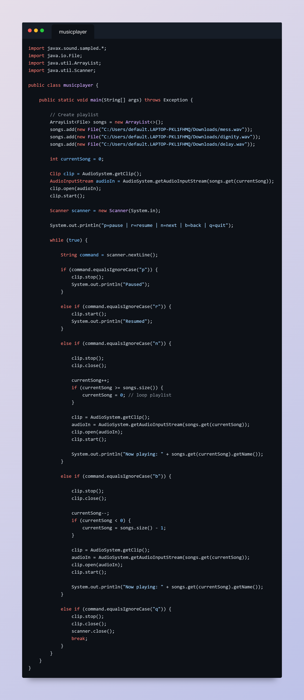

# Home

Hello, I am a freshman in college who is looking to learn more about computer science and coding in general. This last semester was my first introduction to any sort of coding so it's been a pretty busy last few months of learning. I formerly wanted to persue some sort of electric engineering since I have had some previous experience with that but in Eau Claire there weren't that many oppertunities to persue and I wanted to stay close to home. So I decided to look into computer science and here I am today. 

## Projects

### Mandelbrot set

Recently we had the task to generate a mandelbrot set image in class. I have heard of the mandelbrot image before but never really looked into it. Being tasked to look into it, I had learned that it was a very special formula that creates that image. Learning how to implement that formula into java was a really difficult task but after looking at several examples online and getting help from my peers. We were able to come up with some code that can generate the mandelbrot set image. 

We started by creating a complex class that we will be needing for the mandelbrot class. This complex class will help us establish complex numbers that we'll use for the mandelbrot formula. 

This next code is the code that will be generating our mandelbrot image. By stating the height and width of the frame, we'll be able to set up the size of our image as well as how many interations we will be running the code through(the more interations the more accurate and detailed the image will be). Then with a bufferedimage we go through every pixel and see when it escapes the formula creating the infamous image. We then end it off by writing the final image into a png file we can see.

This was the photo we were able to generate.

Overall this project was really difficult to understand at first but after lots of trial and error, I felt like I was able to learn a bit more than I had knew previously before this. We learned how to write code into image files and ultimately how the mandelbrot set works, for the most part... It was a good attempt and I'm glad we persevered through it.

### Music Player

I really enjoy music so I wanted to work on something that can incorporates coding and music. So I decided to create a music player that'll be able to play my music in a playlist. Looking up and learning about java's audio system was really interesting and I was able to create a music player within it.

With this code, I was able to import my own music files and run them through the code to play my music within the system. I also incorporated a pause and resume function so that I could stop the music and play it again whenever I want to. By creating a list of the songs, I was able to make a next song and previous song method. Being able to skip through and go back to songs within my files. It was really fun getting this to work since I previously didn't even know java had an audio system. I'm still learning a lot about java so this was a good thing to work through.

## Future work

TBD, haven't really had much time to work on any other personal side projects.

